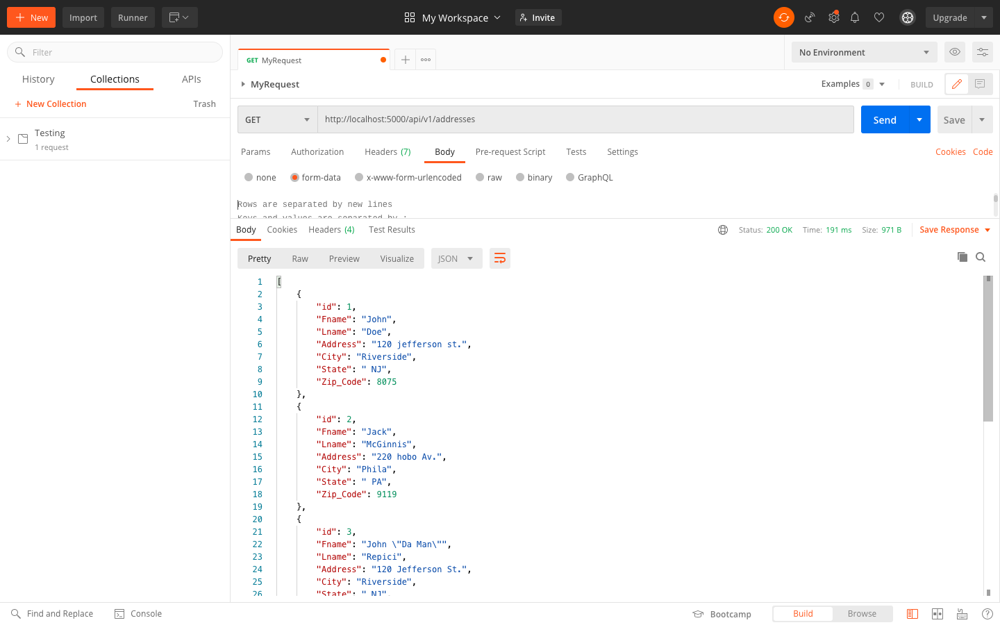
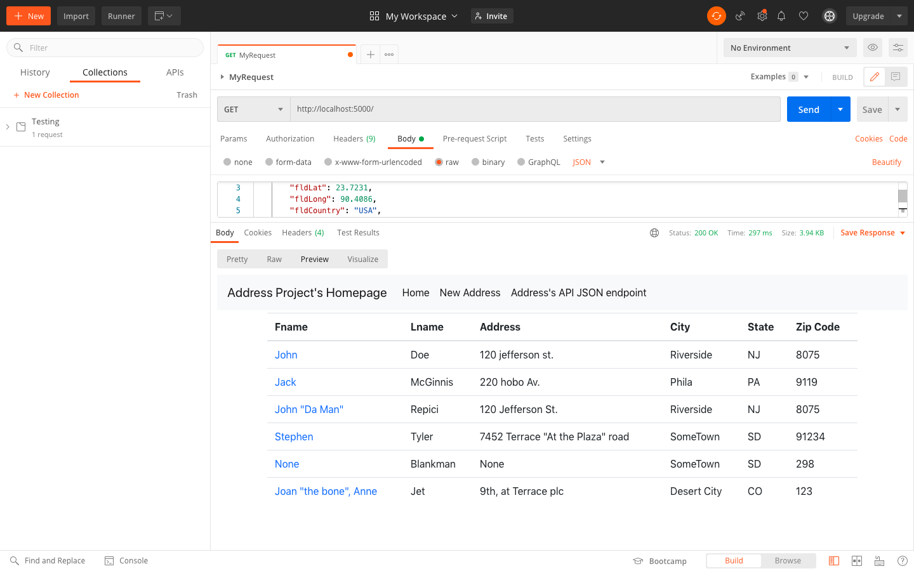
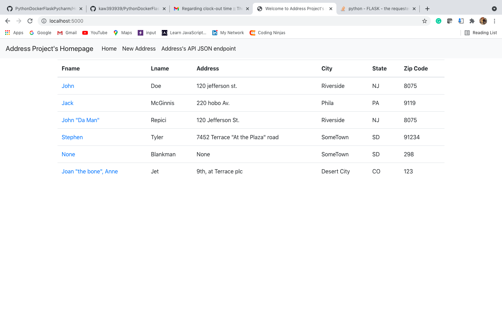
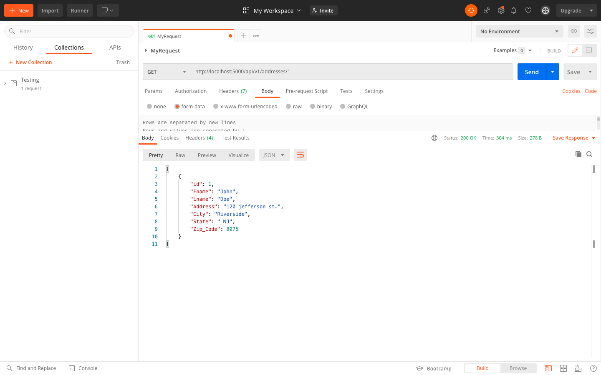
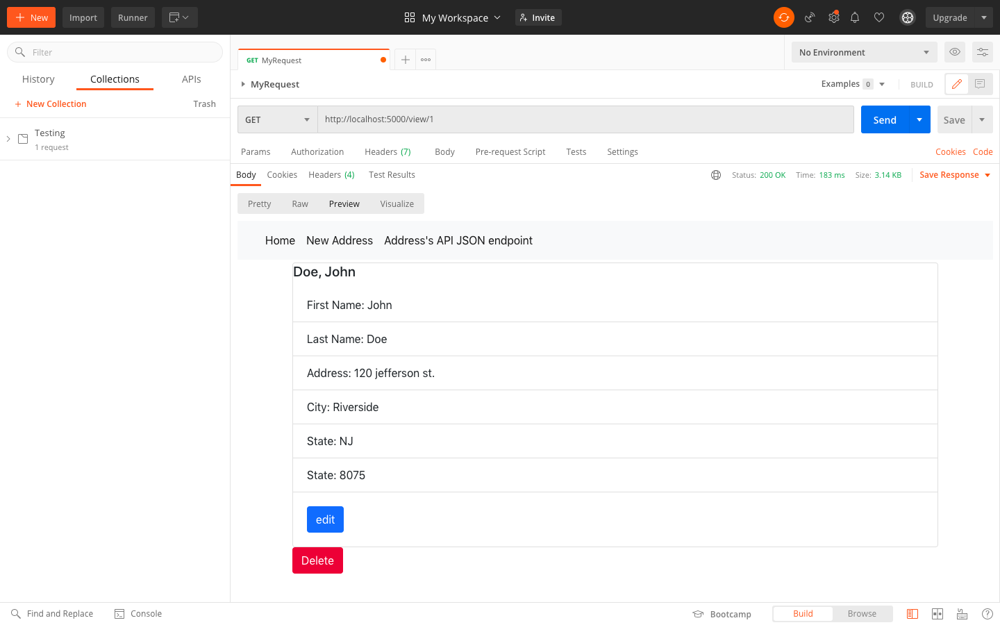
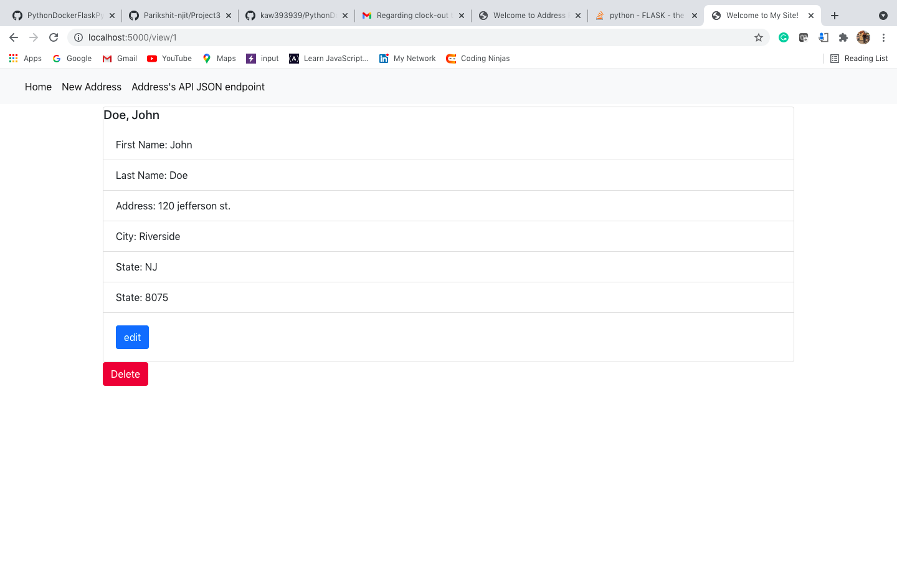
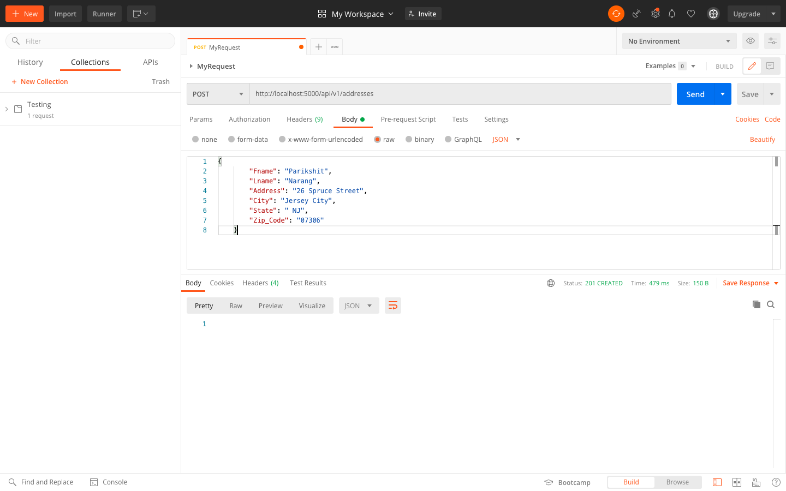
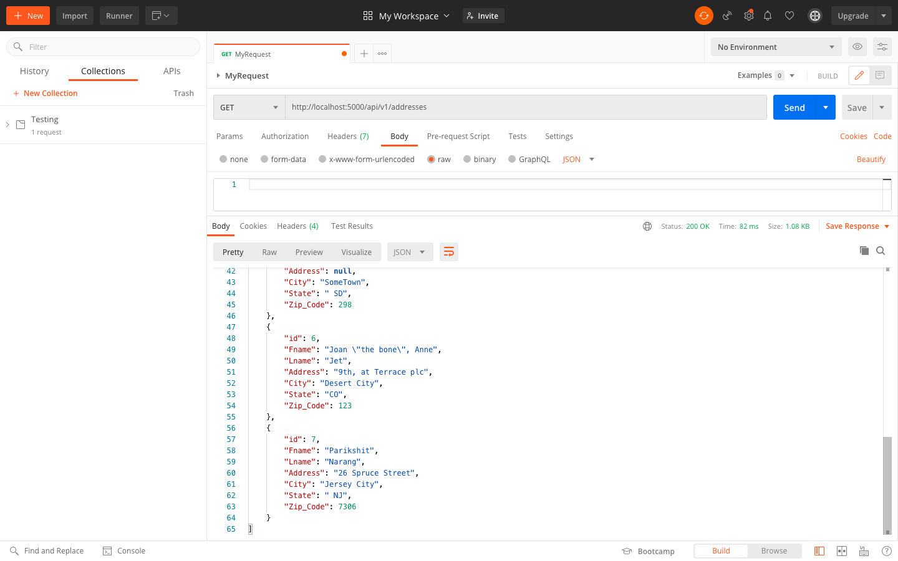

# Project Description
This project is a homework assignment to teach how to get Pycharm setup with Docker, Flask, MySQL, and Postman.

#Screenshots
### Postman Listing All Records

### HTML Page Listing All Records

### Postman Showing One Record with a Get Request

### HTML Page Showing One Record with a Get Request

### Postman Showing Creation of Record
#### Request Screenshot

#### Response Screenshot

